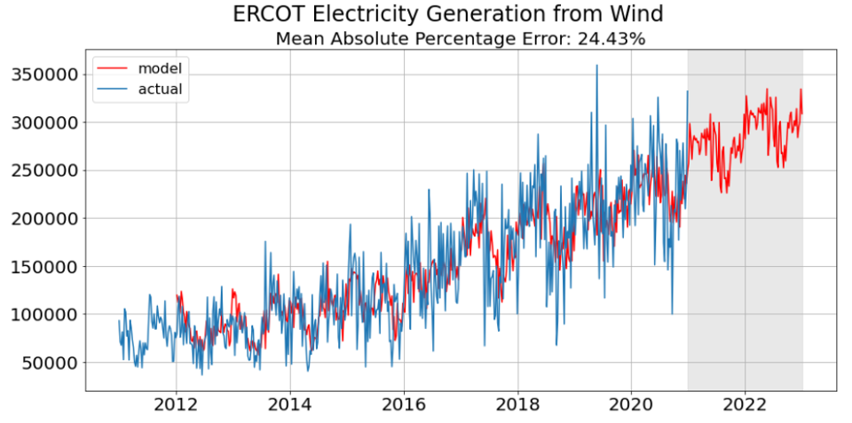
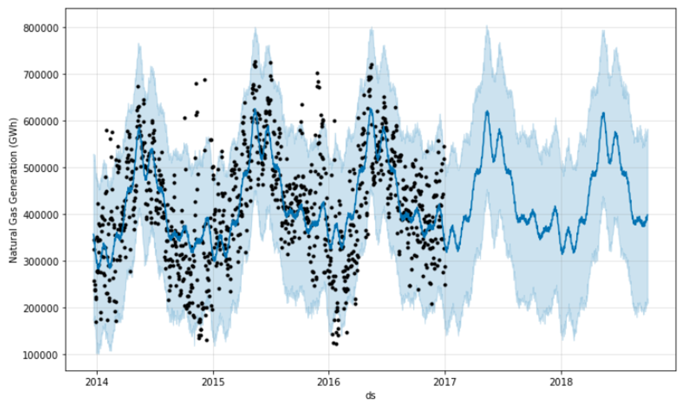

# Time Series Forecasting of Texas Electricity Data
--------

#### The following project was completed as the final capstone for  my Data Science Immersive Bootcamp hosted by General Assembly. Many thanks to Caroline Schmitt, Adi Bronshtein, Alanna Besaw, and Jake Ellena for excellent instruction and support, as well as those in the cohort whom I was I fortunate to have spent the last 12 weeks with.      
-------
## Problem Statement

Winter Storm Uri, which devastated the Texas electrical grid in February of 2021, brought heightened attention to the workings of the deregulated Texas energy market. The grid operator, the Electric Reliability Council of Texas (ERCOT), received much scorn both during and after the winter storm due to calls for not better preparing for this type of event.

Texas' power grid has long been fueled by traditional fossil fuels and nuclear, however wind energy has risen dramatically in recent years and is now the second largest contributor of energy for the ERCOT system. This increased diversity makes the grid much more nimble by not relying so heavily on coal and natural gas, yet the emergence of wind energy as a major contributor results in having a major energy source that unfortunately produces electricity intermittently.

This project aims to conduct univariate and multivariate time series analysis to better forecast how this mix of generation sources is projected to change given current rates. This will help guide infrastructure planning for new pipelines and electric lines as more of this energy comes online. Additionally, through more informed forecasts, ERCOT will potentially be better prepared for the next severe storm even that poses a threat to the grid.

---
## Executive Summary

After extensive review, EDA, and preprocessing, seven production models were developed for forecasting different aspects of the Texas electric grid. Five univariate time series models were created to forecast the top five energy sources for power generation in the state of Texas from 2011-2020. Two multivariate models were created that forecasted natural gas generation based on natural gas generation values and average temperature data. The models developed from our analysis could be used for better forecasting of different energy sources in the Texas grid. Each of the models had varied degrees of success, so further feature engineering and model design could provide more sufficient results.

With the dataset initially being structured in a format of data every 15 minutes as separate columns, extensive data wrangling was required to transform the data into a usable format. Thorough EDA provided in-depth understanding of how our data changes through time and provided key insights for how stationarity would play a role in our time series modeling. A normalized line plot depicted how energy usage changed over the period of interest. Major trends are increasing natural gas and wind at the expense of coal. Solar is significantly, however remains a relatively small component of the energy mix. Box plots were utilized to better understand how the spread of each energy source changed through time. Typically, energy sources like natural gas, coal, and nuclear had more consistent spreads, whereas the renewables showed a wide range of values. This is likely attributable to the intermittency of renewables which are at the mercy of mother nature.

Univariate modeling was conducted for the five largest energy sources in the Texas electricity grid. Plotting of moving averages with anomaly detection highlighted which energy sources proved more reliable over time. Natural gas had the fewest anomalies, while solar and wind energy had the most. A SARIMA model was utilized for the univariate modeling. For the parameters comprising the SARIMA model, a for loop was utilized to seek the minimal Akaike information criterion (AIC). The combination of SARIMA lag that achieved the lowest AIC were saved and incorporated into the fitting of our time series model. Predictions were made for the 104 weeks, or two years, past the actual data. An example of one forecast is presented below:

For each of the univariate models, Mean Absolute Percentage Error (MAPE) was utilized, so that relative performance could be compared between models. Those statistics are presented below:

|Fuel|Mean Absolute Percentage Error|
|---|---|
|Natural Gas|14.0%|
|Coal|9.1%|
|Wind|24.4%|
|Nuclear|7.7%|
|Solar|19.4%|

In addition to univariate time series analysis, multivariate was incorporated to investigate the effects of temperature on natural gas generation. Two datasets were utilized for temperature data. One consisted of monthly average temperature for the state of Texas a whole, which covered 2010-2020. Increased granularity of the temperature data was only accessible by selecting more local data. In this case, the average daily temperature for Austin, TX between 2013-2017 was utilized for multivariate modeling presented below.

The Facebook Prophet modeling package was utilized in this analysis, as it is specifically geared towards modeling with seasonal components. As apparent in the associated notebooks, seasonality and trend are common throughout all time series investigated in this analysis. With the model specifying yearly seasonality, we were able to generate models for both the daily and monthly temperature data. A cross validation functionality present in the Facebook Prophet package allowed for the determination of a variety of performance metrics. In particular, MAPE was once again utilized for the sake of comparison with the univariate models. The monthly multivariate model yielded a MAPE of 68%, which is likely attributable to the sparsity of data in the model. Meanwhile, the daily data yielded a much improved MAPE of 17%. While relatively higher than the univariate model of natural gas (17%), we can say that the model succeeded in capturing the actual data. Further feature engineering and model tinkering could improve the performance. Additionally, identifying other exogeneous features could provide further insight into controls on electricity generation trends.

-----

## Data Description

Data utilized for the project was obtained through a variety of sources, including ERCOT, NOAA, and Kaggle. The electricity generation data originated from the ERCOT website and required extensive manipulation to proceed with a dataset ready for modeling.

**Data Dictionary created for datasets utilized in this analysis**

|Feature|Type|Dataset|Description|
|---|---|---|---|
|date|object|combined_final.csv| Daily dates from 2011-2020 |
|Biomass|float|combined_final.csv| Electricity generated using biomass |
|Coal|float|combined_final.csv| Electricity generated using coal |
|Hydro|float|combined_final.csv| Electricity generated using hydro |
|Other|float|combined_final.csv| Electricity generated using other|
|Solar|float|combined_final.csv| Electricity generated using solar|
|Wind|float|combined_final.csv| Electricity generated using wind|
|NGas|float|combined_final.csv| Electricity generated using natural gas|
|Date|object|texas_temp.csv| Daily dates for Texas temperature data |
|Temp|float|texas_temp.csv| Daily average temperature values for the state of Texas|
|Date|object|austin_weather.csv| Daily date for Austin, TX weather data|
|TempAvgF|object|austin_weather.csv| Average daily temperature for Austin, TX|
|HumidityAvgPercent|object|austin_weather.csv| Average daily humidity for Austin, TX|
|WingAvgMPH|object|austin_weather.csv| Average daily temperature for Austin, TX|

**Data Sources**

##### http://www.ercot.com/gridinfo/generation
##### https://www.ncdc.noaa.gov/cdo-web/datatools
##### https://www.kaggle.com/grubenm/austin-weather

-----
## Conclusions

Electricity generation is a foundational aspect of our society. Providing the optimal balance of reliable and affordable electricity should be the top priority for grids and power providers alike. With the recent winter storm affecting virtually all customers of the Texas ERCOT grid, it is imperative that proper forecasting and planning are utilized to better prepare for future emergency events. The above analysis provides a variety of tools for forecasting electricity generation data. While the univariate forecasts were made two years in advance, this is likely to be better used for short term forecasting, so that resources and systems can be effectively allocated prior to potentially calamitous events. Natural gas was modeled using both univariate and multivariate models. The multivariate model incorporating temperature data did not perform as well as the univariate based on MAPE. However, further feature engineering and model tuning would likely result in more accurate models.
